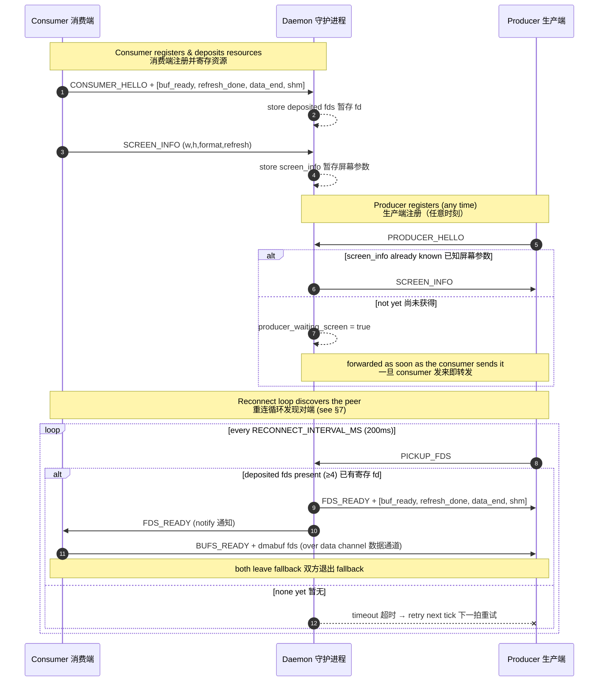
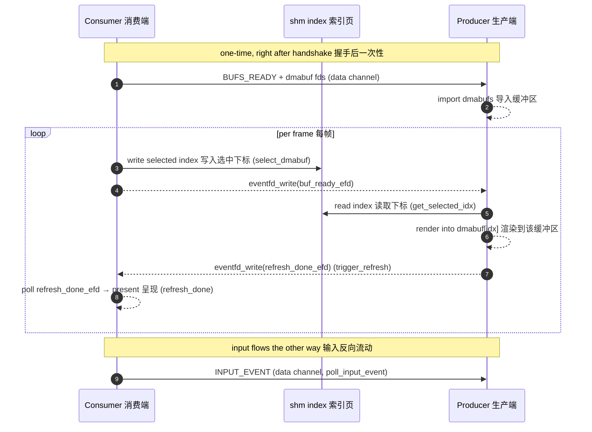
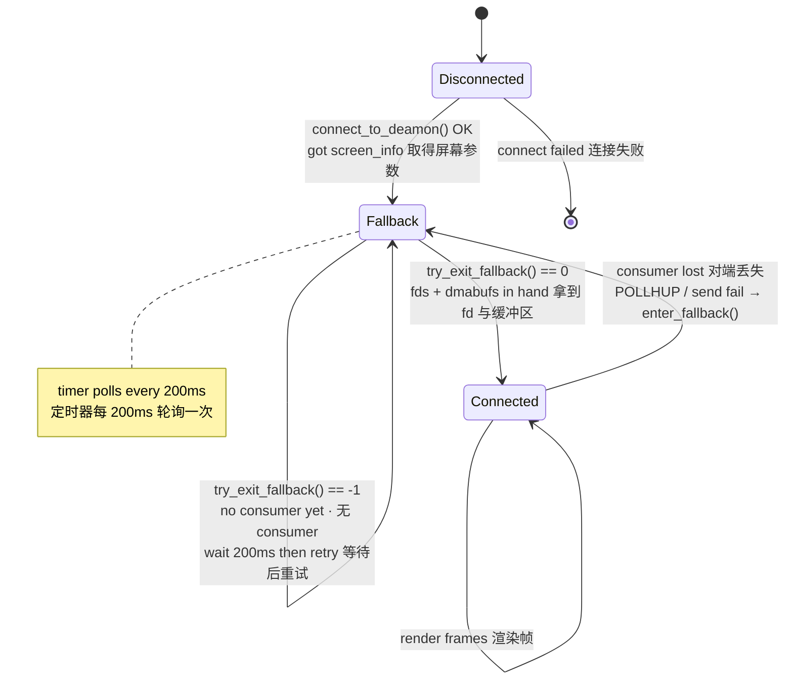
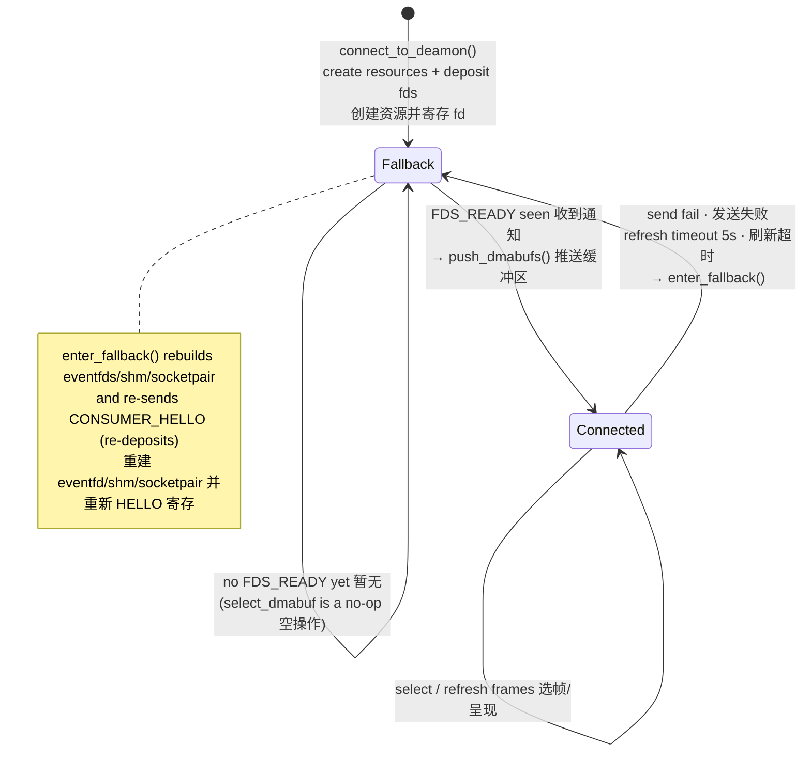
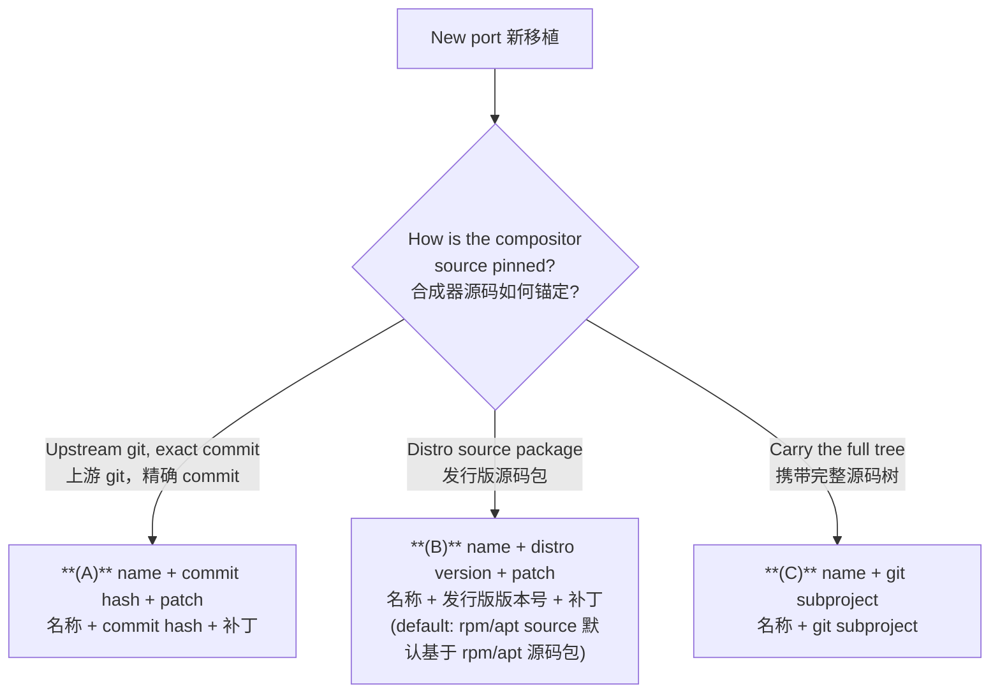
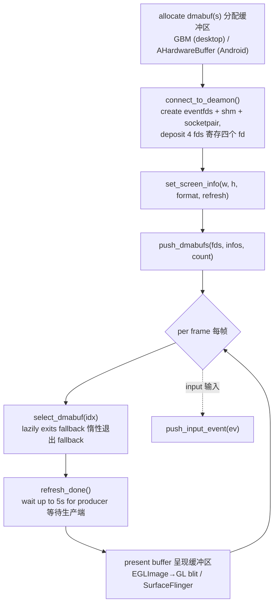

# Anland Display Protocol · Anland 显示协议

> A buffer‑sharing protocol that lets a Linux compositor (KWin / Weston) render its
> desktop into GPU buffers that an Android surface presents, brokered by a small
> daemon over a Unix domain socket.
>
> 一套缓冲区共享协议：Linux 合成器（KWin / Weston）把桌面渲染进 GPU 缓冲区，
> 由 Android 端的显示表面进行呈现，二者通过一个轻量守护进程在 Unix 域套接字上完成对接。

---

## 1. Roles · 角色

| Role 角色 | Binary 程序 | Responsibility 职责 |
|-----------|-------------|---------------------|
| **Daemon** 守护进程 | `daemon` | Rendezvous broker. Holds **at most one** consumer and **one** producer, stores the screen info, and passes file descriptors between them with `SCM_RIGHTS`. 充当对接中介，最多保存一个 consumer 与一个 producer，缓存屏幕信息，并通过 `SCM_RIGHTS` 在两者间传递文件描述符。 |
| **Consumer** 消费端 | Android app / `test_sdl_consumer` | **Owns the resources.** Allocates the dmabufs, the two eventfds, the shm index page and the data‑channel socketpair, and *presents* the rendered frames. 拥有全部资源：分配 dmabuf、两个 eventfd、shm 索引页与数据通道 socketpair，并最终**呈现**已渲染的帧。 |
| **Producer** 生产端 | KWin / Weston `backend-anland` | The compositor. *Renders* desktop content into the consumer's shared buffers. 即合成器，把桌面内容**渲染**进 consumer 提供的共享缓冲区。 |

> [!NOTE]
> **Naming 命名**: the *producer* produces pixel content; the *consumer* consumes
> (displays) it. The consumer is the resource owner because it is the side that
> physically scans the buffers out to the panel.
> “producer” 生产像素内容，“consumer” 消费（显示）这些内容。consumer 是资源拥有者，
> 因为它才是把缓冲区真正扫描输出到屏幕的一方。

---

## 2. Transport & Channels · 传输与通道

There are **four** communication paths. Only the first is a real socket connection to
the daemon; the rest are descriptors the consumer creates and the producer receives.

共有**四条**通信路径。只有第一条是与守护进程的真实套接字连接；其余都是由 consumer
创建、再交给 producer 的描述符。

| Channel 通道 | Kind 类型 | Created by 创建者 | Carries 承载内容 |
|--------------|-----------|-------------------|------------------|
| **Control** 控制通道 | `AF_UNIX` `SOCK_STREAM` to daemon | each peer 各端各一条 | `ctrl_msg` handshake messages 握手控制消息 |
| **Data** 数据通道 | `socketpair()` | Consumer | `data_msg`: dmabuf set + input events 缓冲区集合与输入事件 |
| **buf_ready** | `eventfd` | Consumer | Consumer → Producer: "a buffer is selected, render it" 已选定缓冲区，请渲染 |
| **refresh_done** | `eventfd` | Producer | Producer → Consumer: "frame rendered, present it" 帧已渲染，请呈现 |
| **shm index** 索引页 | 4‑byte `memfd` | Consumer | selected buffer index 当前选中的缓冲区下标 |

Default daemon socket path · 守护进程默认套接字路径:
`/data/local/tmp/display_daemon.sock`

All control/data framing uses a fixed 8‑byte header followed by an optional payload
(`common/protocol.h`):

所有控制/数据帧都是固定 8 字节头部加可选负载（见 `common/protocol.h`）：

```c
struct ctrl_msg { uint32_t type; uint32_t size; uint8_t payload[]; } __attribute__((packed));
struct data_msg { uint32_t type; uint32_t size; uint8_t payload[]; } __attribute__((packed));
```

`size` is the payload length in bytes (header excluded). Reliable framing helpers
`send_all` / `recv_all` and the ancillary‑fd helpers `send_fds` / `recv_fds` live in
`common/socket_utils.c`.

`size` 为负载字节数（不含头部）。可靠收发函数 `send_all` / `recv_all` 及附带 fd 的
`send_fds` / `recv_fds` 见 `common/socket_utils.c`。

---

## 3. The four deposited descriptors · 寄存的四个描述符

When the consumer says hello it attaches **four** fds (via `SCM_RIGHTS`), in this exact
order — see `send_hello_fds()` in `display_consumer.c`:

consumer 打招呼时通过 `SCM_RIGHTS` 附带**四个** fd，顺序固定如下
（见 `display_consumer.c` 的 `send_hello_fds()`）：

| Index 下标 | fd | Direction 方向 | Purpose 用途 |
|:---------:|----|----------------|--------------|
| `fds[0]` | `buf_ready_efd`    | C → P | consumer signals a selected buffer 选定缓冲区的信号 |
| `fds[1]` | `refresh_done_efd` | P → C | producer signals render complete 渲染完成的信号 |
| `fds[2]` | data‑channel end   | C ↔ P | the producer's end of the `socketpair` socketpair 的 producer 端 |
| `fds[3]` | `shm_fd`           | C → P | the 4‑byte selected‑index page 4 字节索引页 |

The consumer keeps `sv[0]` as its own `data_fd` and deposits `sv[1]`. The daemon stores
these as **deposited fds** and hands them to the producer on request.

consumer 自留 `sv[0]` 作为自身 `data_fd`，寄存 `sv[1]`。守护进程把这些保存为
**deposited fds**，待 producer 请求时转交。

---

## 4. Message reference · 消息参考

### 4.1 Control messages (control channel) · 控制消息（控制通道）

| Message 消息 | Value | Direction 方向 | Payload / FDs 负载/描述符 | Meaning 含义 |
|--------------|:-----:|----------------|---------------------------|--------------|
| `CTRL_MSG_CONSUMER_HELLO` | 1 | C → D | + 4 fds | register as consumer & deposit fds 注册为 consumer 并寄存 fd |
| `CTRL_MSG_PRODUCER_HELLO` | 2 | P → D | — | register as producer 注册为 producer |
| `CTRL_MSG_SCREEN_INFO`    | 7 | C → D, D → P | `screen_info` | publish / forward screen geometry 发布/转发屏幕参数 |
| `CTRL_MSG_REJECT`         | 8 | D → C | — | screen‑info mismatch, connection refused 屏幕参数冲突，拒绝 |
| `CTRL_MSG_PICKUP_FDS`     | 9 | P → D | — | producer asks for the deposited fds producer 索取寄存的 fd |
| `CTRL_MSG_FDS_READY`      | 10 | D → P (+4 fds), D → C (notify) | + 4 fds to producer | fds handed over 描述符已交付 |

### 4.2 Data messages (data channel) · 数据消息（数据通道）

| Message 消息 | Value | Direction 方向 | Payload / FDs 负载/描述符 | Meaning 含义 |
|--------------|:-----:|----------------|---------------------------|--------------|
| `DATA_MSG_BUFS_READY` | 200 | C → P | `N × buf_info` + `N` dmabuf fds | the shared dmabuf set 共享缓冲区集合 |
| `DATA_MSG_INPUT_EVENT`| 102 | C → P | `InputEvent` | touch / key / pointer event 触摸/按键/指针事件 |
| `DATA_MSG_BUF_READY`  | 100 | — | *reserved* 保留 | superseded by `buf_ready_efd` 由 eventfd 取代 |
| `DATA_MSG_REFRESH_DONE`| 101 | — | *reserved* 保留 | superseded by `refresh_done_efd` 由 eventfd 取代 |

### 4.3 Structures · 结构体

```c
struct screen_info { uint32_t width, height, format, refresh; };          // 屏幕参数
struct buf_info    { uint32_t stride, format; uint64_t modifier; uint32_t offset; }; // 单个 dmabuf 描述
// struct InputEvent: tagged union over touch / key / pointer_{motion,button,axis}
```

> [!IMPORTANT]
> Per‑frame buffer hand‑off does **not** use data messages. The selected index travels
> through the `shm` page and the two `eventfd`s — see §6.
> 逐帧的缓冲区交接**不**走数据消息。选中下标通过 `shm` 页与两个 `eventfd` 传递，详见 §6。

---

## 5. Handshake flow · 握手流程

The daemon **decouples ordering**: consumer and producer may connect in either order.
Whoever arrives first is parked until the other appears.

守护进程**解耦了连接顺序**：consumer 与 producer 可以任意先后连接。先到者会被暂存，
直到另一端出现。



### Screen‑info lock · 屏幕参数锁

The daemon stores the **first** `screen_info` it sees. A later consumer presenting a
*different* geometry is sent `CTRL_MSG_REJECT` and dropped — the session is locked to a
single display mode (`daemon.c`, `handle_client_data`).

守护进程保存**第一份** `screen_info`。之后若有 consumer 提交**不同**的几何参数，会收到
`CTRL_MSG_REJECT` 并被断开——会话被锁定为单一显示模式（见 `daemon.c` 的
`handle_client_data`）。

---

## 6. Steady‑state frame loop · 稳态帧循环

Once both sides have left fallback, every frame is exchanged **without touching the
daemon** — purely over the shared `shm` page and the two eventfds.

双方退出 fallback 后，每一帧的交换都**不再经过守护进程**——完全通过共享 `shm` 页与
两个 eventfd 完成。



- `select_dmabuf(idx)` → writes `idx` to shm, signals `buf_ready_efd`. 写入下标并触发信号。
- producer wakes on `buf_ready_efd`, reads idx from shm, renders, calls `trigger_refresh()`. 被唤醒后读下标、渲染、回信。
- `refresh_done()` waits on `refresh_done_efd` with a **5 s** timeout → timeout ⇒ fallback. 等待回信，**5 秒**超时即进入 fallback。

---

## 7. State machine · 状态机

Both peers boot **in `fallback`** and *discover each other only by repeatedly attempting
the handshake through the daemon*. There is no direct peer connection and no "peer is
online" notification — discovery **is** a successful reconnect attempt.

两端都以 **`fallback`** 状态启动，且**只能通过守护进程反复尝试握手来发现彼此**。两端之间
没有直接连接，也没有“对端在线”的通知——发现对端**就等于**一次成功的重连尝试。

### 7.1 Producer state machine · 生产端状态机

`connect_to_deamon()` performs **only** the daemon handshake (it fetches `screen_info`)
and deliberately leaves the context in fallback. The backend then runs a timer
(`RECONNECT_INTERVAL_MS = 200 ms`) that polls `try_exit_fallback()`.

`connect_to_deamon()` **只**完成守护进程握手（取得 `screen_info`），随后刻意停留在
fallback。backend 再以定时器（`RECONNECT_INTERVAL_MS = 200 ms`）轮询 `try_exit_fallback()`。



`try_exit_fallback()` is **two‑step and atomic** — fallback clears only when *both*
succeed (`display_producer.c`):

`try_exit_fallback()` 是**两步且原子**的——只有两步**都**成功才会清除 fallback
（见 `display_producer.c`）：

1. **`pickup_fds()`** — send `PICKUP_FDS`, poll `ctrl_fd` (100 ms) for `FDS_READY`,
   receive the 4 fds, `mmap` the shm. 发送 `PICKUP_FDS`，轮询 100 ms 等 `FDS_READY`，
   收下 4 个 fd 并 `mmap` 索引页。
2. **`receive_dmabufs()`** — poll `data_fd` (100 ms) for `BUFS_READY`, store the dmabuf
   set. 轮询 100 ms 等 `BUFS_READY`，保存缓冲区集合。

Any failure → `release_consumer_resources()` and stay in fallback, safe to retry next
tick. On success the backend wires up the fd event sources and imports the dmabufs
(`anland_consumer_connected()`).

任一步失败即 `release_consumer_resources()` 并留在 fallback，可在下一拍安全重试。成功后
backend 注册 fd 事件源并导入缓冲区（`anland_consumer_connected()`）。

### 7.2 Consumer state machine · 消费端状态机

The consumer creates its resources and deposits them at `connect_to_deamon()`, starting
in fallback. It leaves fallback **lazily**: each `select_dmabuf()` first calls
`try_exit_fallback()`, which simply checks whether the daemon has forwarded an
`FDS_READY` (i.e. a producer has just picked up the fds).

consumer 在 `connect_to_deamon()` 时创建资源并寄存，初始为 fallback。它**惰性**退出
fallback：每次 `select_dmabuf()` 先调用 `try_exit_fallback()`，仅检查守护进程是否已转发
`FDS_READY`（即刚有 producer 取走了 fd）。



> [!NOTE]
> **Why the producer is the active poller 为何由 producer 主动轮询**: the producer cannot
> tell whether a consumer exists, so it keeps asking the daemon "give me the fds"
> (`PICKUP_FDS`) every 200 ms. The daemon answers `FDS_READY` *only* when it actually
> holds a consumer's deposited fds — so the producer discovers the consumer purely by an
> attempt succeeding. The consumer learns a producer appeared when the daemon forwards
> that same `FDS_READY` to it.
> producer 无法得知 consumer 是否存在，于是每 200 ms 向守护进程索取 fd（`PICKUP_FDS`）。
> 守护进程**仅**在确实持有 consumer 寄存的 fd 时才回 `FDS_READY`——因此 producer 完全靠
> “尝试成功”来发现 consumer；而当守护进程把同一个 `FDS_READY` 转发给 consumer 时，
> consumer 便得知 producer 已出现。

---

## 8. Disconnection & recovery · 断连与恢复

| Event 事件 | Detected by 检测方 | Reaction 反应 |
|------------|--------------------|---------------|
| Producer drops consumer 对端丢失 | `POLLHUP`/`POLLERR` on `data_fd`, or send failure 数据通道挂断或发送失败 | `enter_fallback()`: release consumer resources, fire callback, resume 200 ms reconnect timer. 释放资源、触发回调、恢复重连定时器。 |
| Consumer loses producer 失去对端 | send failure or 5 s `refresh_done` timeout 发送失败或 5 秒刷新超时 | `enter_fallback()`: tear down + rebuild eventfds/shm/socketpair, re‑send `CONSUMER_HELLO` (re‑deposit). 拆除并重建资源，重新 HELLO 寄存。 |
| Consumer reconnects mid‑session 会话中重连 | daemon `CONSUMER_HELLO` with ≥3 fds 守护进程收到带 fd 的 HELLO | replaces deposited fds; if a producer is waiting, delivers immediately. 替换寄存 fd；若 producer 正等待则立即交付。 |
| Either peer reconnects 任一端重连 | new `*_HELLO` 新的 HELLO | the daemon frees the previous client of that role and installs the new one. 守护进程释放该角色的旧连接并接纳新连接。 |

Because re‑entering fallback re‑deposits a fresh resource set, recovery flows back
through the **exact same** reconnect path as first‑time discovery — there is a single
code path for "bring the consumer up", whether it is the first time or the hundredth.

由于重新进入 fallback 会再次寄存一套全新资源，恢复过程会沿着与首次发现**完全相同**的
重连路径回流——无论第一次还是第一百次，“拉起 consumer”都只有一条代码路径。

---

## 9. Design notes · 设计要点

- **Single reconnect path 单一重连路径** — both startup and recovery funnel through
  `try_exit_fallback()`; there is no separate "first connect" logic. 启动与恢复都汇入
  `try_exit_fallback()`，没有单独的“首次连接”逻辑。
- **Atomic exit 原子退出** — the producer leaves fallback only with *both* the fds and the
  dmabufs in hand, so the backend can import and render immediately. producer 必须同时
  拿到 fd 与 dmabuf 才退出 fallback，从而可立即导入并渲染。
- **Daemon is off the hot path 守护进程不在热路径** — it only brokers the handshake; every
  frame afterwards is shm + eventfd, zero daemon round‑trips. 守护进程只负责握手，之后
  每帧仅用 shm + eventfd，零守护进程往返。
- **Non‑blocking handshake 非阻塞握手** — handshake polls use a short `100 ms` timeout so
  the producer's reconnect loop stays responsive when no consumer is present. 握手轮询采用
  较短的 `100 ms` 超时，保证无 consumer 时 producer 的重连循环仍然灵敏。
- **Display‑mode lock 显示模式锁** — the first `screen_info` wins; mismatching consumers are
  rejected. 以第一份 `screen_info` 为准，参数不符的 consumer 会被拒绝。

---

## 10. Producer porting guide · 生产端移植指南

This section is the **contribution spec** for porting a new compositor (producer) onto
the protocol. A port lives under `producers/<compositor>/…` and must build, install and
run. For the display side, see §11 (consumer porting guide).

本节是把新合成器（生产端）接入本协议的**提交规范**。每个移植放在 `producers/<合成器>/…`
下，且必须能够编译、安装并运行。显示端请参见 §11（消费端移植指南）。

### 10.1 Library‑sharing policy · 库共享策略

| Port 移植 | Library wiring 库的接入方式 |
|-----------|------------------------------|
| **Weston** — the producer reference, the **only** producer port allowed to symlink 唯一允许软链接的生产端参考实现 | symlink the in‑repo library directly 直接软链接仓库内的库 |
| **Every other compositor** 其它任何合成器 | **vendor (copy) the library** into the port's own tree **必须拷贝一份库**到移植自己的目录 |

Weston symlinks the shared sources so the reference port always tracks the canonical
library:

Weston 通过软链接共享源码，使参考实现始终跟随仓库内的权威库：

```
producers/weston/common               -> ../../common
producers/weston/libdisplay_producer  -> ../../libdisplay_producer
```

Every other port must **copy** `protocol.h`, `socket_utils.{c,h}` and
`display_producer.{c,h}` into its own source tree (the KDE ports place them under
`src/backends/anland/`). Copying — never symlinking — insulates a shipped port from
**later API changes** in the in‑repo library: a downstream build that already works will
not break when the headers here evolve.

其它移植必须把 `protocol.h`、`socket_utils.{c,h}`、`display_producer.{c,h}` **拷贝**进
自己的源码树（KDE 移植放在 `src/backends/anland/`）。只拷贝、绝不软链接，可使已发布的
移植不受仓库内库**后续 API 变化**的影响：一份已经能用的下游构建，不会因为这里的头文件
演进而被破坏。

### 10.2 ABI compatibility promise · ABI 兼容承诺

A vendored copy stays interoperable because the **protocol ABI is backward compatible**.
Future evolution is constrained to two additive‑only directions:

拷贝的副本之所以能长期互通，是因为**协议 ABI 向下兼容**。未来演进被限制为以下两个
**仅新增**的方向：

1. **New packets on the data channel** — new `DATA_MSG_*` types added on `data_fd`. An
   old producer ignores types it does not recognise. 在数据通道（`data_fd`）上**新增
   数据包**，即新增 `DATA_MSG_*` 类型；旧 producer 忽略不认识的类型。
2. **New fields in the shared‑memory page** — the shm hand‑off page is a reserved
   **4 KiB** page; today only **offset 0** holds the selected buffer index. New state is
   **appended at higher offsets**, never overlapping offset 0. 在**共享内存页**中**追加
   字段**——该交接页为预留的 **4 KiB** 页，目前仅 **偏移 0** 存放选中的缓冲区下标；
   新状态在**更高偏移处追加**，绝不覆盖偏移 0。

What never changes incompatibly: the four‑fd handshake and its fd order, the existing
`ctrl_msg`/`data_msg` framing, the existing struct layouts (`screen_info`, `buf_info`,
`InputEvent`), and the "selected index at shm offset 0" contract. A port built today
keeps working against a future consumer.

以下内容绝不发生不兼容变更：四‑fd 握手及其 fd 顺序、现有 `ctrl_msg`/`data_msg` 帧格式、
现有结构体布局（`screen_info`、`buf_info`、`InputEvent`），以及“选中下标位于 shm 偏移 0”
的约定。今天构建的移植在未来的 consumer 上仍可工作。

### 10.3 Accepted port structures · 可接受的移植结构

A port must declare **the compositor name** and exactly **one** of the three structures
below. Choose by how the compositor source is pinned:

每个移植必须标注**合成器名称**，并采用下列三种结构中的**恰好一种**。按合成器源码的
锚定方式选择：



| # | Structure 结构 | Pin 锚定 | Deliverable 交付物 | Example in repo 仓库示例 |
|:-:|----------------|----------|--------------------|--------------------------|
| **A** | name + **upstream commit hash** + patch 名称 + 上游 commit hash + 补丁 | a specific upstream git commit 指定上游 git commit | a `.patch` that applies on that commit 可应用于该 commit 的 `.patch` | — |
| **B** | name + **non‑rolling distro version** + patch 名称 + 非滚动发行版版本号 + 补丁 | a fixed distro release; **default: built on the rpm/apt source package** 固定发行版；**默认基于 rpm/apt 源码包** | a `.patch` against that source package 针对该源码包的 `.patch` | [producers/kde/ubuntu2404](producers/kde/ubuntu2404), [producers/kde/ubuntu2604](producers/kde/ubuntu2604) |
| **C** | name + **git subproject** 名称 + git subproject | a vendored full source tree 携带完整源码树 | the subproject tree + integration files 子工程树 + 集成文件 | [producers/weston](producers/weston) |

> [!NOTE]
> Structures **A** and **B** are *patch‑based*: ship only your diff plus a way to fetch
> the exact upstream (commit hash, or distro version + `rpm/apt source`). Structure **C**
> carries the whole compositor tree. Do **not** mix a rolling/unpinned base with a patch —
> the patch must apply against an exactly reproducible source.
> **A**、**B** 为*补丁式*：只提交你的 diff，加上获取确切上游的方式（commit hash，或
> 发行版版本号 + `rpm/apt source`）。**C** 携带整个合成器源码树。**不要**用滚动/未锚定的
> 基线配补丁——补丁必须能应用在可精确复现的源码上。

### 10.4 Submission checklist · 提交规范清单

- [ ] Lives under `producers/<compositor>/…`. 位于 `producers/<合成器>/…` 下。
- [ ] Weston is the **only** symlink producer port; any new producer port **vendors a copy**
      of the library. 仅 Weston 生产端使用软链接；新生产端移植**拷贝一份库**。
- [ ] Declares the compositor name and one of structures **A / B / C** (with the commit
      hash / distro version as required). 标注合成器名称及 **A / B / C** 之一（按需附 commit
      hash / 发行版版本号）。
- [ ] **Builds and deploys** via a committed build/install script (e.g. `build.sh` /
      `build_and_install.sh`). 附带可执行的构建/安装脚本，能**编译并部署**。
- [ ] Producer integrates the state machine of §7: connect → start in fallback → poll
      `try_exit_fallback()` on a reconnect timer → re‑arm on the fallback callback.
      Producer 按 §7 接入状态机：连接 → 以 fallback 启动 → 用重连定时器轮询
      `try_exit_fallback()` → 在 fallback 回调中重新触发。
- [ ] Only additive protocol use; relies on the §10.2 ABI promise rather than editing the
      framing/structs. 仅做加法式扩展；依赖 §10.2 的 ABI 承诺，而非修改帧格式/结构体。

---

## 11. Consumer porting guide · 消费端移植指南

This section is the **contribution spec** for porting a new *consumer* (the display /
presentation side) onto the protocol. A consumer lives under `consumers/<name>/…` and
must build and run.

本节是把新**消费端**（显示/呈现侧）接入本协议的**提交规范**。每个消费端放在
`consumers/<名称>/…` 下，且必须能够编译并运行。

The consumer is the **resource owner**: it allocates the dmabufs and creates the eventfds,
the shm index page and the data‑channel socketpair (see §2–§3). Porting one is mostly
wiring the library's calls to your platform's buffer allocator and presentation path.

消费端是**资源拥有者**：它分配 dmabuf 并创建 eventfd、shm 索引页与数据通道 socketpair
（见 §2–§3）。移植主要是把库的调用接到所在平台的缓冲区分配器与呈现路径。

### 11.1 Library‑sharing policy · 库共享策略

Symmetric to the producer side (§10.1):

与生产端（§10.1）对称：

| Port 移植 | Library wiring 库的接入方式 |
|-----------|------------------------------|
| **`anland`** — the consumer reference, the **only** consumer port allowed to symlink 唯一允许软链接的消费端参考实现 | symlink the in‑repo library directly 直接软链接仓库内的库 |
| **Every other consumer** 其它任何消费端 | **vendor (copy)** `common/` + `libdisplay_consumer/` into the port's own tree 把库**拷贝**进自己的目录 |

The reference consumer symlinks the shared sources:

参考消费端通过软链接共享源码：

```
consumers/anland/common              -> ../../common
consumers/anland/libdisplay_consumer -> ../../libdisplay_consumer
```

Every other consumer copies `protocol.h`, `socket_utils.{c,h}` and
`display_consumer.{c,h}` into its own tree —
[consumers/anland_virtual_keyboard](consumers/anland_virtual_keyboard) is the worked
example. Copying insulates a shipped consumer from later API changes, and the §10.2 ABI
promise keeps the copy interoperable with newer producers.

其它消费端把 `protocol.h`、`socket_utils.{c,h}`、`display_consumer.{c,h}` 拷贝进自己的
源码树——[consumers/anland_virtual_keyboard](consumers/anland_virtual_keyboard) 即范例。
拷贝使已发布的消费端不受后续 API 变化影响，而 §10.2 的 ABI 承诺保证拷贝与更新的生产端
仍可互通。

### 11.2 Consumer integration contract · 消费端集成约定

Bring‑up is a fixed sequence built on the consumer API
([libdisplay_consumer/display_consumer.h](libdisplay_consumer/display_consumer.h)):

接入流程是基于消费端 API 的固定顺序
（[libdisplay_consumer/display_consumer.h](libdisplay_consumer/display_consumer.h)）：



| Step 步骤 | Call 调用 | Consumer must provide 消费端需提供 |
|-----------|-----------|-------------------------------------|
| 1. Allocate 分配 | platform allocator 平台分配器 | a dmabuf fd + `buf_info` (stride, format, DRM modifier, offset) dmabuf fd 与 `buf_info` |
| 2. Connect 连接 | `connect_to_deamon()` | nothing — the lib creates and deposits the resources 无需额外操作，库自动创建并寄存资源 |
| 3. Geometry 几何 | `set_screen_info()` | width, height, agreed `format`, refresh 宽、高、约定的 `format`、刷新率 |
| 4. Publish buffers 发布缓冲 | `push_dmabufs()` | the dmabuf fd(s) + their `buf_info`(s) 缓冲区 fd 与对应 `buf_info` |
| 5. Drive frames 驱动帧 | `select_dmabuf()` → `refresh_done()` | pick a buffer, wait for render, then present 选缓冲、等渲染、再呈现 |
| 6. Input 输入 | `push_input_event()` | translate platform input → `struct InputEvent` 将平台输入转换为 `struct InputEvent` |
| 7. Fallback 回退 | `set_fallback_callback()` (optional 可选) | react when the producer is lost 生产端丢失时作出反应 |

State machine: the consumer starts in fallback and leaves it **lazily** — each
`select_dmabuf()` first probes for the producer (see §7.2). On producer loss the library
rebuilds its resources and re‑deposits automatically; the stored dmabufs are re‑pushed on
the next exit. You do **not** re‑allocate buffers on every reconnect.

状态机：消费端以 fallback 启动并**惰性**退出——每次 `select_dmabuf()` 先探测生产端
（见 §7.2）。生产端丢失时，库会自动重建资源并重新寄存；已保存的 dmabuf 在下次退出
fallback 时重新推送。你**无需**在每次重连时重新分配缓冲区。

> [!NOTE]
> `format` is an opaque enum agreed between consumer and producer (the SDL reference maps
> its `PIXEL_FORMAT_RGBA_8888` to a DRM fourcc for the EGL import). `buf_info.modifier`
> carries the DRM format modifier so the producer imports with the exact tiling.
> `format` 是消费端与生产端约定的不透明枚举（SDL 参考把 `PIXEL_FORMAT_RGBA_8888` 映射为
> DRM fourcc 以供 EGL 导入）。`buf_info.modifier` 携带 DRM 格式修饰符，使生产端能以确切的
> 平铺方式导入。

### 11.3 Accepted port structures · 可接受的移植结构

The three structures of §10.3 apply, with "compositor" read as "the host app or platform"
the consumer builds on. A **self‑contained** consumer (the common case — e.g. the Android
reference app) is carried as its own source tree under `consumers/<name>/` (structure
**C**). A consumer that *patches* an existing upstream app uses **A** / **B** as for
producers.

§10.3 的三类结构同样适用，只需把“合成器”理解为消费端所基于的“宿主应用或平台”。
**自包含**的消费端（常见情形——如 Android 参考应用）以自身源码树形式放在
`consumers/<名称>/` 下（结构 **C**）。若消费端是对既有上游应用**打补丁**，则按生产端的
**A** / **B** 处理。

### 11.4 Submission checklist · 提交规范清单

- [ ] Lives under `consumers/<name>/…`. 位于 `consumers/<名称>/…` 下。
- [ ] `anland` is the **only** symlink consumer port; any new consumer **vendors a copy**
      of `common/` + `libdisplay_consumer/`. 仅 `anland` 使用软链接；新消费端**拷贝一份**
      `common/` 与 `libdisplay_consumer/`。
- [ ] Declares the consumer name and one of structures **A / B / C** (§10.3). 标注消费端
      名称及 **A / B / C** 之一（§10.3）。
- [ ] **Builds and runs** via a committed build script. 附带可执行构建脚本，能**编译运行**。
- [ ] Owns its buffers: allocates the dmabufs and follows the §11.2 sequence; presents on
      `refresh_done()`. 自行分配 dmabuf 并遵循 §11.2 流程；在 `refresh_done()` 后呈现。
- [ ] Integrates the consumer state machine of §7.2 (lazy fallback exit; rebuild on loss).
      接入 §7.2 的消费端状态机（惰性退出 fallback；丢失时重建）。
- [ ] Only additive protocol use; relies on the §10.2 ABI promise. 仅做加法式扩展；依赖
      §10.2 的 ABI 承诺。

---

## 12. Source map · 源码索引

| Area 区域 | File 文件 |
|-----------|-----------|
| Wire format & constants 协议常量 | [common/protocol.h](common/protocol.h) |
| Framing & fd passing 收发与 fd 传递 | [common/socket_utils.c](common/socket_utils.c) |
| Broker 中介 | [daemon/daemon.c](daemon/daemon.c) |
| Consumer library 消费端库 | [libdisplay_consumer/display_consumer.c](libdisplay_consumer/display_consumer.c) |
| Producer library 生产端库 | [libdisplay_producer/display_producer.c](libdisplay_producer/display_producer.c) |
| Producer state machine in a real backend 真实 backend 中的状态机 | [producers/weston/weston/libweston/backend-anland/anland.c](producers/weston/weston/libweston/backend-anland/anland.c) |
| Reference consumer 参考消费端 (Android) | [consumers/anland/](consumers/anland/) |
| Reference SDL consumer 参考 SDL 消费端 | [tests/test_sdl_consumer.c](tests/test_sdl_consumer.c) |
| Consumer that vendors the lib 拷贝库的消费端示例 | [consumers/anland_virtual_keyboard/](consumers/anland_virtual_keyboard/) |

---

## 13. License · 许可

This project's own code is **MIT**‑licensed. Each non‑reference compositor backend
carries **its own upstream license** instead.

本项目自有代码采用 **MIT** 许可。每个非参考合成器后端则**附带其自身的上游许可**。

### 12.1 MIT‑licensed components · MIT 许可的组成部分

| Component 组成部分 | Path 路径 |
|--------------------|-----------|
| Reference consumer 参考消费端 (Android) | [consumers/anland/](consumers/anland/) |
| Shared protocol & utils 共享协议与工具 | [common/](common/) |
| Broker daemon 中介守护进程 | [daemon/](daemon/) |
| Reference C libraries 参考 C 库 | [libdisplay_consumer/](libdisplay_consumer/), [libdisplay_producer/](libdisplay_producer/) |
| Reference compositor backend 参考合成器后端 (Weston anland backend) | [producers/weston/weston/libweston/backend-anland/](producers/weston/weston/libweston/backend-anland/) + the `producers/weston/` integration glue 集成胶水代码 |

> A **vendored copy** of the reference C library that a port embeds in its own tree
> (per §10.1) **follows the host compositor's license**, not MIT — e.g. a copy embedded
> into GPL KWin is distributed under KWin's GPL terms. The MIT grant applies to the
> canonical library in this repo ([libdisplay_producer/](libdisplay_producer/) etc.).
> 移植按 §10.1 嵌入自身源码树的**参考 C 库拷贝**，**跟随宿主合成器的许可**，而非 MIT——
> 例如嵌入 GPL 版 KWin 的拷贝按 KWin 的 GPL 条款分发。MIT 仅覆盖本仓库中的权威库本身
> （[libdisplay_producer/](libdisplay_producer/) 等）。

### 12.2 Components under their own license · 附带自身许可的组成部分

| Component 组成部分 | License 许可 | Notes 说明 |
|--------------------|--------------|------------|
| Other compositor backends 其余合成器后端, e.g. [producers/kde/](producers/kde/) | upstream's own license 上游自身许可 (KWin: GPL‑2.0‑or‑later) | the patches target GPL‑licensed KWin; the derived work follows KWin's terms 补丁基于 GPL 许可的 KWin，衍生作品遵循 KWin 条款 |
| Vendored upstream compositor trees 携带的上游合成器源码树, e.g. [producers/weston/weston/](producers/weston/weston/) | its own upstream license 上游自身许可 (Weston: MIT/Expat, see its `COPYING`) | the upstream source retains its original license; only the anland backend we add is MIT under this project 上游源码保留其原始许可，仅我们新增的 anland 后端按本项目以 MIT 授权 |

> [!NOTE]
> When porting a new backend (§10.3), the upstream compositor source you patch or vendor
> keeps **its** license; only the integration code you author for the **reference**
> compositor is MIT. Other backends ship under their upstream terms.
> 移植新后端时（§10.3），你打补丁或携带的上游合成器源码保留**其**许可；只有你为**参考**
> 合成器编写的集成代码按 MIT 授权。其余后端按其上游条款发布。
