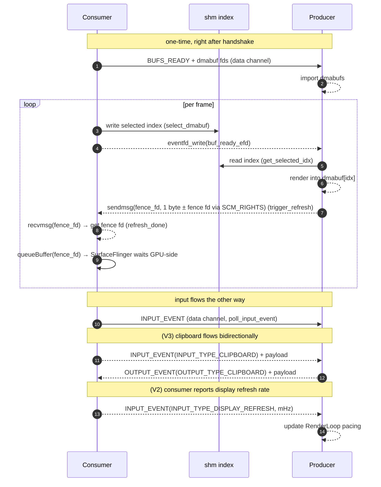
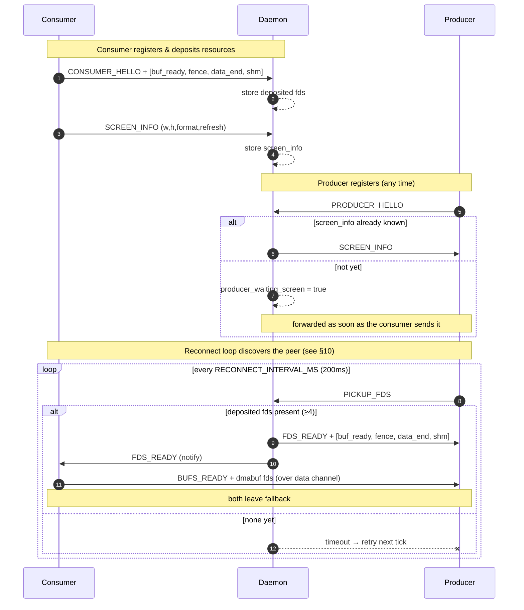
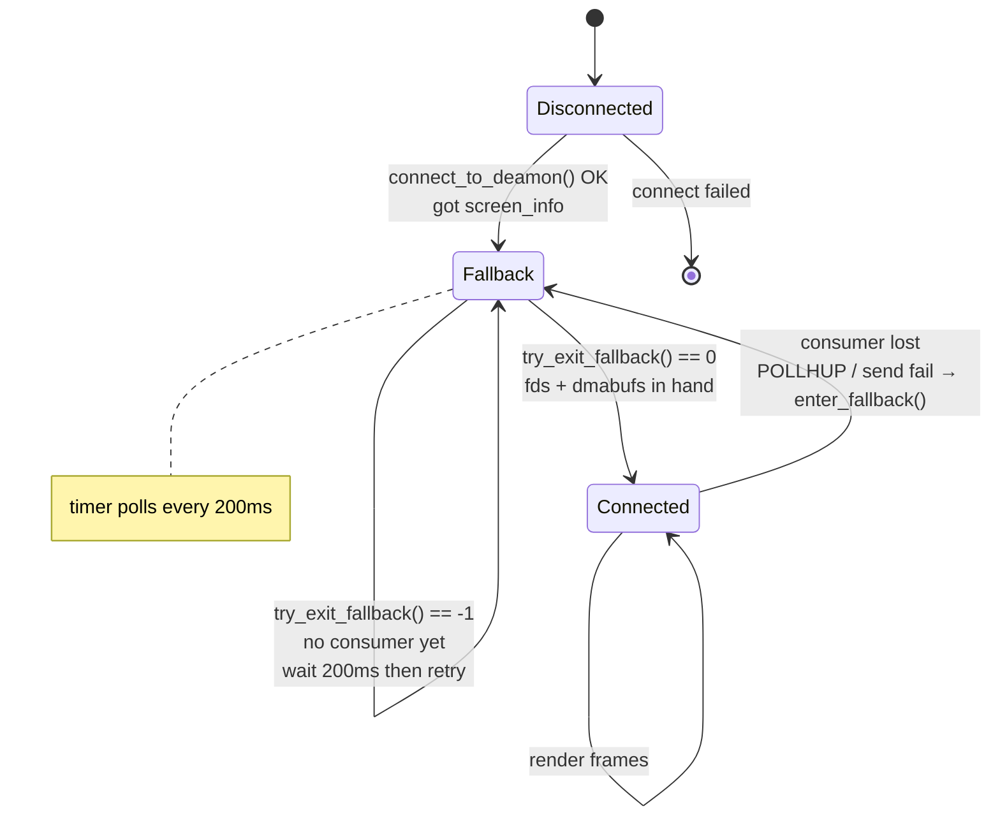
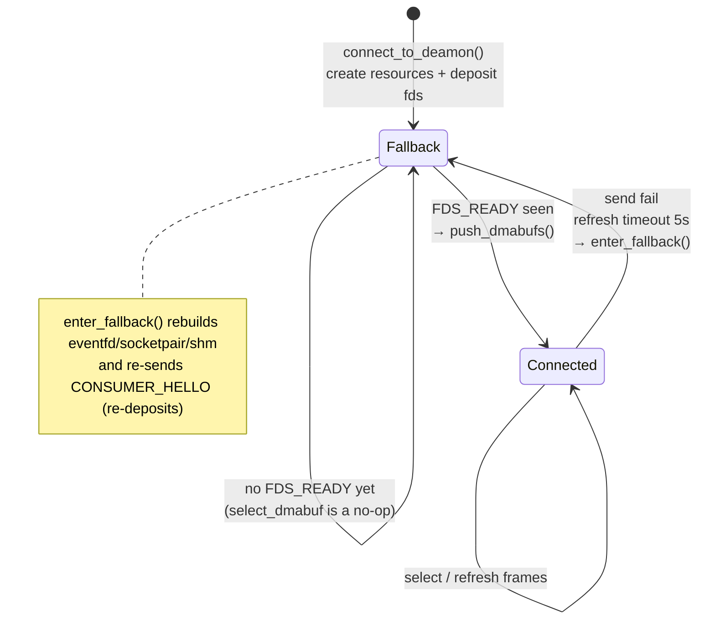

# Anland Display Protocol V3

> A buffer‑sharing protocol that lets a Linux compositor (KWin / Weston) render its
> desktop into GPU buffers that an Android surface presents, brokered by a small
> daemon over a Unix domain socket.
>
> **V3** adds **bidirectional clipboard exchange** — the producer (compositor) and
> consumer (Android display) can push clipboard content to each other over the data
> channel. Clipboard data uses a **variable‑length** two‑packet protocol (header +
> payload), which introduces **ABI and API incompatibilities** with V2: callers must
> handle all event types or explicitly drain unhandled variable‑length payloads.

> **[中文版](README_zh.md)**

---

## 1. Roles

| Role | Binary | Responsibility |
|------|--------|----------------|
| **Daemon** | `daemon` | Rendezvous broker. Holds **at most one** consumer and **one** producer, stores the screen info, and passes file descriptors between them with `SCM_RIGHTS`. **Unchanged from V2.** |
| **Consumer** | Android app / `test_sdl_consumer` | **Owns the resources.** Allocates the dmabufs, the buffer‑ready eventfd, the shm index page, and **two** socketpairs (`data` + `fence`), and *presents* the rendered frames. In V3 also **receives clipboard data** from the producer. |
| **Producer** | KWin / Weston `backend‑anland` | The compositor. *Renders* desktop content into the consumer's shared buffers. In V3 also **receives clipboard data** from the consumer and **sends clipboard data** to the consumer. |

> [!NOTE]
> **Naming**: the *producer* produces pixel content; the *consumer* consumes
> (displays) it. The consumer is the resource owner because it is the side that
> physically scans the buffers out to the panel.

---

## 2. V3 changes at a glance

| Aspect | V2 | V3 | Impact |
|--------|----|----|--------|
| Clipboard | Consumer → Producer only | **Bidirectional** | New `DATA_MSG_OUTPUT_EVENT`(103) P→C direction |
| Variable‑length events | Not used | `clipboard.size` + trailing payload | ❌ **ABI incompatible**: old `poll_input_event()` cannot drain variable payload, corrupts stream |
| `handle_unhandled_event()` | Not required | **Mandatory** | ❌ **API incompatible**: unhandled variable events must be drained explicitly |
| `push_input_event_with_length()` / `push_output_event_with_length()` | Not required | **Mandatory for clipboard** | Signature unchanged, but variable events **must not** use `push_input_event()` / `push_output_event()` |
| Daemon | — | **Unchanged** | Zero changes |

> [!CAUTION]
> **ABI incompatibility**: a V3 consumer may send `INPUT_TYPE_CLIPBOARD`
> events whose trailing payload bytes exceed `sizeof(struct InputEvent)`. A V2
> producer that only calls `poll_input_event()` (which reads exactly one fixed‑size
> `InputEvent`) will **leave the trailing bytes in the socket buffer**, corrupting
> all subsequent messages. The same applies in the reverse direction for
> `DATA_MSG_OUTPUT_EVENT` with clipboard payloads.

---

## 3. Transport & Channels

There are **four** communication paths — same as V2, with the fence channel using
a **socketpair** and the data channel now carrying **variable‑length output events**.

| Channel | Kind | Created by | Carries |
|---------|------|------------|---------|
| **Control** | `AF_UNIX` `SOCK_STREAM` to daemon | each peer | `ctrl_msg` handshake messages |
| **Data** | `socketpair()` | Consumer | `data_msg`: dmabuf set + input events + **output events** |
| **buf_ready** | `eventfd` | Consumer | Consumer → Producer: "a buffer is selected, render it" |
| **fence** | `socketpair()` | Consumer | Producer → Consumer: render‑done message + optional `SCM_RIGHTS` fence fd |
| **shm index** | 4‑byte `memfd` | Consumer | selected buffer index |

Default daemon socket path:
`/data/local/tmp/display_daemon.sock`

All control/data framing uses a fixed 8‑byte header followed by an optional payload
(`common/protocol.h`):

```c
struct ctrl_msg { uint32_t type; uint32_t size; uint8_t payload[]; } __attribute__((packed));
struct data_msg { uint32_t type; uint32_t size; uint8_t payload[]; } __attribute__((packed));
```

`size` is the payload length in bytes (header excluded). Reliable framing helpers
`send_all` / `recv_all` and the ancillary‑fd helpers `send_fds` / `recv_fds` live in
`common/socket_utils.c`.

---

## 4. The four deposited descriptors

When the consumer says hello it attaches **four** fds (via `SCM_RIGHTS`), in this exact
order — see `send_hello_fds()` in `display_consumer.c`:

| Index | Direction | Purpose |
|:-----:|-----------|---------|
| `fds[0]` | C → P | `buf_ready_efd`: consumer signals a selected buffer |
| `fds[1]` | P → C | `fence_fd` socketpair write end: render‑done message + optional fence fd via `SCM_RIGHTS` |
| `fds[2]` | C ↔ P | data‑channel end: the producer's end of the socketpair |
| `fds[3]` | C → P | `shm_fd`: the 4‑byte selected‑index page |

> **V3 unchanged**: fd slots are identical to V2

The consumer keeps `sv[0]` as its own `data_fd` and deposits `sv[1]`. The daemon stores
these as **deposited fds** and hands them to the producer on request. **The daemon is
opaque to the fd semantics — no daemon update needed.**

---

## 5. Message reference

### 5.1 Control messages (control channel)

| Message | Value | Direction | Payload / FDs | Meaning |
|---------|:-----:|-----------|---------------|---------|
| `CTRL_MSG_CONSUMER_HELLO` | 1 | C → D | + 4 fds | register as consumer & deposit fds |
| `CTRL_MSG_PRODUCER_HELLO` | 2 | P → D | — | register as producer |
| `CTRL_MSG_SCREEN_INFO`    | 7 | C → D, D → P | `screen_info` | publish / forward screen geometry |
| `CTRL_MSG_REJECT`         | 8 | D → C | — | screen‑info mismatch, connection refused |
| `CTRL_MSG_PICKUP_FDS`     | 9 | P → D | — | producer asks for the deposited fds |
| `CTRL_MSG_FDS_READY`      | 10 | D → P (+4 fds), D → C (notify) | + 4 fds to producer | fds handed over |

### 5.2 Data messages (data channel)

| Message | Value | Direction | Payload / FDs | Meaning |
|---------|:-----:|-----------|---------------|---------|
| `DATA_MSG_BUFS_READY` | 200 | C → P | `N × buf_info` + `N` dmabuf fds | the shared dmabuf set |
| `DATA_MSG_INPUT_EVENT`| 102 | C → P | `InputEvent` | touch / key / pointer / clipboard / display refresh |
| `DATA_MSG_OUTPUT_EVENT`| **103** | **P → C** | `OutputEvent` | **clipboard** from producer (**V3 bidirectional**) |
| `DATA_MSG_BUF_READY`  | 100 | — | *reserved* | superseded by `buf_ready_efd` |
| `DATA_MSG_REFRESH_DONE`| 101 | — | *reserved* | superseded by **fence channel** |

### 5.3 Structures

```c
struct screen_info { uint32_t width, height, format, refresh; };

struct buf_info {
    uint32_t stride;
    uint32_t width;
    uint32_t height;
    uint32_t format;
    uint64_t modifier;
    uint32_t offset;
};

struct InputEvent {
    uint32_t type;
    union {
        struct { int32_t action; float x, y; int32_t pointer_id; } touch;
        struct { int32_t action; int32_t keycode; } key;
        struct { float x, y, dx, dy; } pointer_motion;
        struct { uint32_t button; int32_t pressed; } pointer_button;
        struct { uint32_t axis; float value; int32_t discrete; } pointer_axis;
        struct { uint32_t refresh_mhz; } display;
        struct { uint32_t size; } clipboard;
        struct { uint32_t padding[4]; };
    };
} __attribute__((packed));

struct OutputEvent{
    uint32_t type;
    union {
        struct { uint32_t size; } clipboard;
        struct { uint32_t padding[4]; };
    };
} __attribute__((packed));
```

#### InputEvent types

| Type | Value | V1 | V2 | V3 | Payload | Variable? |
|------|:-----:|:--:|:--:|:--:|---------|:---------:|
| `INPUT_TYPE_TOUCH` | 1 | ✅ | ✅ | ✅ | `touch { action, x, y, pointer_id }` | No |
| `INPUT_TYPE_KEY` | 2 | ✅ | ✅ | ✅ | `key { action, keycode }` | No |
| `INPUT_TYPE_POINTER_MOTION` | 3 | ✅ | ✅ | ✅ | `pointer_motion { x, y, dx, dy }` | No |
| `INPUT_TYPE_POINTER_BUTTON` | 4 | ✅ | ✅ | ✅ | `pointer_button { button, pressed }` | No |
| `INPUT_TYPE_POINTER_AXIS` | 5 | ✅ | ✅ | ✅ | `pointer_axis { axis, value, discrete }` | No |
| `INPUT_TYPE_TOUCH_FRAME` | 6 | — | ✅ | ✅ | — (frame boundary) | No |
| `INPUT_TYPE_DISPLAY_REFRESH` | 7 | — | ✅ | ✅ | `display { refresh_mhz }` | No |
| `INPUT_TYPE_CLIPBOARD` | 8 | — | — | **✅ V3 new** | `clipboard { size }` + variable‑length data | **Yes** |

#### OutputEvent types

| Type | Value | V2 | V3 | Payload | Variable? |
|------|:-----:|:--:|:--:|---------|:---------:|
| `OUTPUT_TYPE_CLIPBOARD` | 1 | — | **✅ V3 new** | `clipboard { size }` + variable‑length data | **Yes** |

> [!IMPORTANT]
> Per‑frame buffer hand‑off does **not** use data messages. The selected index travels
> through the `shm` page, `buf_ready_efd` (select) and the **fence channel**
> (render‑done + optional fence). — see §7.

---

## 6. Variable‑length event protocol (V3 key change)

V3 introduces **variable‑length events** on the data channel. Previously all
`InputEvent` and `OutputEvent` messages had a fixed size. In V3, clipboard events
carry a **header** packet (the fixed‑size event struct with `clipboard.size` set)
immediately followed by `clipboard.size` bytes of raw payload.

### 6.1 Wire format

```
Standard event (fixed size):
┌──────────────────┬────────────────────┐
│ data_msg header  │ InputEvent/OutputEvent │
│ type + size(=20) │ type + union        │
└──────────────────┴────────────────────┘

Variable‑length event (V3 clipboard):
┌──────────────────┬────────────────────┬─────────────────────┐
│ data_msg header  │ InputEvent/OutputEvent │ payload bytes      │
│ type + size(=20) │ type + clipboard.size  │ (clipboard.size)   │
└──────────────────┴────────────────────┴─────────────────────┘
                        ▲ header ▲          ▲ trailing data ▲
```

> [!CAUTION]
> **The `data_msg.size` field always equals `sizeof(InputEvent)` or
> `sizeof(OutputEvent)` (20 bytes)** — it does NOT include the trailing payload.
> The trailing payload size is carried inside `clipboard.size`. Receivers must
> **additionally** read `clipboard.size` bytes after consuming the event struct.

### 6.2 Sending rules

- **Clipboard events MUST use `push_*_with_length()`** — the `_with_length` variant
  appends the payload bytes in the same `send_all()` call.
- **Non‑clipboard events use `push_*()`** — fixed‑size, no trailing data.

```c
// ✅ Correct: clipboard with variable‑length payload
struct InputEvent ev = { .type = INPUT_TYPE_CLIPBOARD, .clipboard.size = len };
push_input_event_with_length(ctx, &ev, text, len);

// ❌ WRONG: sending clipboard without trailing data
push_input_event(ctx, &ev);  // consumer receives event but NO payload → stream corruption
```

### 6.3 Receiving rules

When `poll_input_event()` or `poll_output_event()` returns an event with
`type == INPUT_TYPE_CLIPBOARD` or `type == OUTPUT_TYPE_CLIPBOARD`, the receiver
**MUST** drain the trailing payload by calling `poll_input_event_extend_data()` or
`poll_output_event_extend_data()`, even if it intends to discard the data.

**Producer side:**

```c
struct InputEvent ev;
if (poll_input_event(ctx, &ev, 16) > 0) {
    switch (ev.type) {
    case INPUT_TYPE_CLIPBOARD:
        // Option A: use the data
        poll_input_event_extend_data(ctx, buf, ev.clipboard.size, 1000);
        setSystemClipboard(buf, ev.clipboard.size);
        break;
    case INPUT_TYPE_DISPLAY_REFRESH:
        output->setRefreshRate(ev.display.refresh_mhz);
        break;
    // ... other fixed‑size events ...
    default:
        handle_unhandled_event(ctx, &ev);  // MUST drain unknown variable‑length events
        break;
    }
}
```

**Consumer side:**

```c
struct OutputEvent ev;
if (poll_output_event(ctx, &ev, 100) > 0) {
    switch (ev.type) {
    case OUTPUT_TYPE_CLIPBOARD:
        poll_output_event_extend_data(ctx, buf, ev.clipboard.size, 1000);
        setAndroidClipboard(buf, ev.clipboard.size);
        break;
    default:
        handle_unhandled_event(ctx, &ev);  // MUST drain unknown variable‑length events
        break;
    }
}
```

### 6.4 `handle_unhandled_event()`

Both libraries provide `handle_unhandled_event()` which drains the trailing payload
of known variable‑length event types that the caller did not process. **This function
is mandatory** — failing to call it (or `*_extend_data()`) for unprocessed clipboard
events leaves bytes in the socket buffer and corrupts the stream.

```c
// Producer: drain unhandled consumer events
void handle_unhandled_event(display_ctx *ctx, const struct InputEvent *event) {
    switch (event->type) {
    case INPUT_TYPE_CLIPBOARD:
        if (event->clipboard.size > 0) {
            void *payload = malloc(event->clipboard.size);
            if (payload) {
                poll_input_event_extend_data(ctx, payload, event->clipboard.size, 1000);
                free(payload);
            }
        }
        break;
    default:
        break;
    }
}

// Consumer: drain unhandled producer events
void handle_unhandled_event(display_ctx *ctx, const struct OutputEvent *event) {
    switch (event->type) {
    case OUTPUT_TYPE_CLIPBOARD:
        if (event->clipboard.size > 0) {
            void *payload = malloc(event->clipboard.size);
            if (payload) {
                poll_output_event_extend_data(ctx, payload, event->clipboard.size, 1000);
                free(payload);
            }
        }
        break;
    default:
        break;
    }
}
```

---

## 7. Steady‑state frame loop

Once both sides have left fallback, every frame is exchanged **without touching the
daemon** — over the shared `shm` page, `buf_ready_efd` and the **dedicated fence
channel** (`socketpair`). V3 adds clipboard exchanges on the data channel, but these
are **asynchronous and do not affect the frame cadence**.



- `select_dmabuf(idx)` → writes `idx` to shm, signals `buf_ready_efd`.
- producer wakes on `buf_ready_efd`, reads idx from shm, renders, may call
  `set_render_fence(fence_fd)` to stash a render-done fence, then calls
  `trigger_refresh()`.
- `trigger_refresh()` sends 1 byte (+ optionally fence fd via `SCM_RIGHTS`)
  on the fence socketpair.
- `refresh_done()` waits on fence channel with a **5 s** timeout, reads the message,
  returns the fence fd (or `-1` if none).

### 7.1 Clipboard exchange (V3)

Clipboard data is exchanged **bidirectionally** over the data channel using a
two‑packet protocol: a **header** packet (`InputEvent` / `OutputEvent` with
`clipboard.size`) followed by the **payload** bytes.

**Consumer → Producer** (via `push_input_event_with_length`):

| Step | What happens |
|------|-------------|
| 1 | Consumer calls `push_input_event_with_length(ctx, &clipboard_event, data, len)` |
| 2 | Library sends `DATA_MSG_INPUT_EVENT` with `type=INPUT_TYPE_CLIPBOARD`, `size=len` |
| 3 | Immediately sends `len` bytes of raw clipboard payload (same `send_all()` call) |
| 4 | Producer receives via `poll_input_event()` → sees `INPUT_TYPE_CLIPBOARD` → `poll_input_event_extend_data()` |

**Producer → Consumer** (via `push_output_event_with_length`):

| Step | What happens |
|------|-------------|
| 1 | Producer calls `push_output_event_with_length(ctx, &clipboard_event, data, len)` |
| 2 | Library sends `DATA_MSG_OUTPUT_EVENT` with `type=OUTPUT_TYPE_CLIPBOARD`, `size=len` |
| 3 | Immediately sends `len` bytes of raw clipboard payload (same `send_all()` call) |
| 4 | Consumer's event thread receives via `poll_output_event()` → sees `OUTPUT_TYPE_CLIPBOARD` → `poll_output_event_extend_data()` |

> [!NOTE]
> **Echo guard**: to prevent clipboard echo loops, the consumer tracks the
> last sent clipboard text and does not re‑send text it received from the producer.

---

## 8. Handshake flow

The daemon **decouples ordering**: consumer and producer may connect in either order.
Whoever arrives first is parked until the other appears. **The handshake wire protocol
is unchanged from V2.**



### Screen‑info lock

The daemon stores the **first** `screen_info` it sees. A later consumer presenting a
*different* geometry is sent `CTRL_MSG_REJECT` and dropped — the session is locked to a
single display mode (`daemon.c`, `handle_client_data`).

---

## 9. State machine

Both peers boot **in `fallback`** and *discover each other only by repeatedly attempting
the handshake through the daemon*. There is no direct peer connection and no "peer is
online" notification — discovery **is** a successful reconnect attempt. **The state
machine is unchanged from V2.**

### 9.1 Producer state machine

`connect_to_deamon()` performs **only** the daemon handshake (it fetches `screen_info`)
and deliberately leaves the context in fallback. The backend then runs a timer
(`RECONNECT_INTERVAL_MS = 200 ms`) that polls `try_exit_fallback()`.



`try_exit_fallback()` is **two‑step and atomic** — fallback clears only when *both*
succeed (`display_producer.c`):

1. **`pickup_fds()`** — send `PICKUP_FDS`, poll `ctrl_fd` (100 ms) for `FDS_READY`,
   receive **4** fds, `mmap` the shm.
2. **`receive_dmabufs()`** — poll `data_fd` (100 ms) for `BUFS_READY`, store the dmabuf
   set.

Any failure → `release_consumer_resources()` and stay in fallback, safe to retry next
tick.

### 9.2 Consumer state machine

The consumer creates its resources and deposits them at `connect_to_deamon()`, starting
in fallback. It leaves fallback **lazily**: each `select_dmabuf()` first calls
`try_exit_fallback()`.



> [!NOTE]
> **V3 addition**: the consumer exposes a `set_exit_fallback_callback()` to let the
> host app react when the producer reconnects (e.g. start the event thread, sync
> clipboard). This is **optional** and does not change the state machine.

---

## 10. Disconnection & recovery

| Event | Detected by | Reaction |
|-------|-------------|----------|
| Producer drops consumer | `POLLHUP`/`POLLERR` on `data_fd`, or send failure | `enter_fallback()`: release consumer resources, fire callback, resume 200 ms reconnect timer. |
| Consumer loses producer | send failure or 5 s `refresh_done` timeout | `enter_fallback()`: tear down + rebuild eventfd/socketpair/shm, re‑send `CONSUMER_HELLO` (re‑deposit). |
| Consumer reconnects mid‑session | daemon `CONSUMER_HELLO` with ≥3 fds | replaces deposited fds; if a producer is waiting, delivers immediately. |
| Either peer reconnects | new `*_HELLO` | the daemon frees the previous client of that role and installs the new one. |

---

## 11. Design notes

- **Single reconnect path** — both startup and recovery funnel through
  `try_exit_fallback()`; there is no separate "first connect" logic.
- **Atomic exit** — the producer leaves fallback only with *both* the fds and the
  dmabufs in hand, so the backend can import and render immediately.
- **Daemon is off the hot path** — it only brokers the handshake; every
  frame afterwards is shm + eventfd + fence channel, zero daemon round‑trips.
- **Non‑blocking handshake** — handshake polls use a short `100 ms` timeout so
  the producer's reconnect loop stays responsive when no consumer is present.
- **Display‑mode lock** — the first `screen_info` wins; mismatching consumers are
  rejected.
- **GPU‑side fence** — the producer sends a real dma-buf sync-file fence via
  `SCM_RIGHTS`; the consumer hands it to SurfaceFlinger, eliminating CPU‑side
  `glFinish()` stalls.
- **Bidirectional clipboard (V3)** — clipboard data flows both ways over the
  data channel using a header + payload two‑packet protocol. An echo guard prevents
  loops. Variable‑length events require all receivers to drain trailing payloads.
- **Must‑drain protocol** — any event type with a variable‑length payload
  (currently clipboard) **must** be drained via `handle_unhandled_event()` or
  `*_extend_data()`, even if the caller does not care about the data. Failure to do
  so corrupts the data channel stream.

---

## 12. API Changes from V2

### 12.1 Producer library (`libdisplay_producer`) — **API and ABI incompatible**

| Function | V2 | V3 | Compatibility |
|----------|----|----|---------------|
| `connect_to_deamon()` | Same signature | Same signature | ✅ Unchanged |
| `disconnect()` | Same signature | Same signature | ✅ Unchanged |
| `get_screen_info()` | Same signature | Same signature | ✅ Unchanged |
| `trigger_refresh()` | Same signature | Same signature | ✅ Unchanged |
| `set_render_fence()` | Same signature | Same signature | ✅ Unchanged |
| `push_output_event()` | Same signature | Same signature | ⚠️ **Not for clipboard** (use `push_output_event_with_length()`) |
| `is_fallback()` / `try_exit_fallback()` / `set_fallback_callback()` | Same signature | Same signature | ✅ Unchanged |
| `poll_input_event()` | Same signature | Same signature | ⚠️ **Behavior change**: may return `INPUT_TYPE_CLIPBOARD`, caller must drain |
| `get_data_fd()` / `get_buffer_ready_fd()` / `get_buf_count()` / `get_selected_idx()` / `get_dmabuf_fd()` / `get_dmabuf_fd_at()` / `get_dmabuf_info()` / `get_dmabuf_info_at()` | Same signature | Same signature | ✅ Unchanged |
| `poll_input_event_extend_data()` | — | **V3 new**: drain variable-length input payload | ❌ **Required**: must call when handling `INPUT_TYPE_CLIPBOARD` |
| `push_output_event_with_length()` | — | **V3 new**: send variable-length output event (clipboard) | ✅ New API |
| `handle_unhandled_event()` | — | **V3 new**: drain unhandled variable-length events | ❌ **Required**: must call to keep stream clean |

> **Producer incompatibility**: V2 producer's `poll_input_event()` signature is unchanged, but its **behavior changed**. A V3 consumer may send `INPUT_TYPE_CLIPBOARD` variable-length events. A V2 producer that does not drain the trailing payload will corrupt the data channel stream.

### 12.2 Consumer library (`libdisplay_consumer`) — **API and ABI incompatible**

| Function | V2 | V3 | Compatibility |
|----------|----|----|---------------|
| `connect_to_deamon()` | Same signature | Same signature | ✅ Unchanged |
| `refresh_done()` | Returns fence fd (>=0 or -1) | Same signature | ✅ Unchanged |
| `push_dmabufs()` | Same signature | Same signature | ✅ Unchanged |
| `select_dmabuf()` | Same signature | Same signature | ✅ Unchanged |
| `set_screen_info()` | Same signature | Same signature | ✅ Unchanged |
| `set_fallback_callback()` | Same signature | Same signature | ✅ Unchanged |
| `disconnect()` | Same signature | Same signature | ✅ Unchanged |
| `push_input_event()` | Same signature | Same signature | ⚠️ **Not for clipboard** (use `push_input_event_with_length()`) |
| `poll_output_event()` | — | **V3 new**: poll producer→consumer output events | ✅ New API |
| `push_input_event_with_length()` | — | **V3 new**: send variable-length input event (clipboard) | ✅ New API |
| `poll_output_event_extend_data()` | — | **V3 new**: drain variable-length output payload | ✅ New API |
| `set_exit_fallback_callback()` | — | **V3 new**: callback on producer reconnect | ✅ New API |
| `get_data_fd()` | — | **V3 new**: get data channel fd | ✅ New API |
| `handle_unhandled_event()` | — | **V3 new**: drain unhandled variable-length events | ❌ **Required**: must call to keep stream clean |

> **Consumer incompatibility**: A V3 producer may send `DATA_MSG_OUTPUT_EVENT`(103) with clipboard payload. A V2 consumer has no `poll_output_event()` and cannot read these messages, corrupting the data channel stream.

### 12.3 Wire protocol — **incompatible**

| Aspect | V2 | V3 | Compatibility |
|--------|----|----|---------------|
| `DATA_MSG_OUTPUT_EVENT` (103) | Does not exist | New | ❌ V2 consumer cannot recognize |
| `INPUT_TYPE_CLIPBOARD` (8) | Does not exist | New | ❌ V2 producer does not drain payload |
| `OUTPUT_TYPE_CLIPBOARD` | Does not exist | New | ❌ Same |
| Variable‑length payload | Does not exist | `clipboard.size` + trailing bytes | ❌ Fixed-size receivers cannot handle |
| `struct InputEvent` | 7 types (union size = 20B) | 8 types (union size unchanged) | ✅ Struct size unchanged |
| `struct OutputEvent` | Does not exist | New (20B) | ❌ V2 has no such struct |
| `struct buf_info` | `{ stride, width, height, format, modifier, offset }` | Same | ✅ Unchanged |
| Control messages | All unchanged | All unchanged | ✅ |

### 12.4 Daemon — **no update needed**

| Aspect | Note |
|--------|------|
| fd relay | Daemon stores/forwards fds via `SCM_RIGHTS`, **unaware** of individual fd semantics |
| slot count | Both V2 and V3 consumer deposit **4** fds |
| ctrl_msg types | All message types unchanged |
| **Conclusion** | **Zero daemon changes, binary compatible** |

---

## 13. Compatibility Summary

| Component | Compatibility | Needs changes |
|-----------|---------------|---------------|
| **Producer library** | **Incompatible** | **Must update**: handle `INPUT_TYPE_CLIPBOARD` or call `handle_unhandled_event()` |
| **Consumer library** | **Incompatible** | **Must update**: add `poll_output_event()` or call `handle_unhandled_event()` |
| **Daemon** | **Fully compatible** | Zero changes |
| **Wire protocol** | **Incompatible** | V3 introduces variable-length events and new message type (103) |

### Cross-version interop

| Scenario | Result |
|----------|--------|
| V3 producer + V3 consumer | ✅ **Works** — bidirectional clipboard, display refresh, runtime resolution changes |
| V2 producer + V3 consumer | ❌ **Stream corruption** — V2 `poll_input_event()` does not drain trailing payload |
| V3 producer + V2 consumer | ❌ **Stream corruption** — V2 consumer cannot read `DATA_MSG_OUTPUT_EVENT`(103) |
| V2 producer + V2 consumer | ✅ **Works** — same as V2 behavior |
| V1 producer + V3 `libdisplay_producer.so` | ❌ **Stream corruption** — V1 code does not drain clipboard payload |
| V1 producer + V3 consumer (no clipboard) | ⚠️ **Conditional** — works if consumer never sends clipboard, but not guaranteed |
| V1 consumer + V3 `libdisplay_consumer.so` | ❌ **Incompatible** — `refresh_done()` returns fence fd (V2 change) |
| V3 daemon + V2/V3 producer/consumer | ✅ **Works** — daemon is unaware of fd semantics |

> [!CAUTION]
> **V2/V1 producer mixed with V3 consumer corrupts stream**: even if V2/V1 producer code links against V3 library, if its event loop does not call `handle_unhandled_event()`, the clipboard payload bytes are left in the socket buffer, corrupting the data channel stream. **Application code must be updated.**
>
> **V2 consumer cannot mix with V3 producer**: V2 consumer lacks `poll_output_event()` and cannot read `DATA_MSG_OUTPUT_EVENT`(103). **Library and code must be upgraded.**

---

## 14. Migration Guide

### 14.1 Producer — **must update event handling code**

V2 producer code **must be updated** to handle V3 variable-length events:

**V2 code (incompatible):**
```c
struct InputEvent ev;
if (poll_input_event(ctx, &ev, 16) > 0) {
    switch (ev.type) {
    case INPUT_TYPE_TOUCH:
        handle_touch(&ev.touch);
        break;
    case INPUT_TYPE_KEY:
        handle_key(&ev.key);
        break;
    // ... other fixed-size events ...
    // ❌ missing INPUT_TYPE_CLIPBOARD handling → stream corruption
    }
}
```

**V3 code (compatible):**
```c
struct InputEvent ev;
if (poll_input_event(ctx, &ev, 16) > 0) {
    switch (ev.type) {
    case INPUT_TYPE_TOUCH:
        handle_touch(&ev.touch);
        break;
    case INPUT_TYPE_KEY:
        handle_key(&ev.key);
        break;
    case INPUT_TYPE_DISPLAY_REFRESH:
        output->setRefreshRate(ev.display.refresh_mhz);
        break;
    case INPUT_TYPE_CLIPBOARD:
        poll_input_event_extend_data(ctx, buf, ev.clipboard.size, 1000);
        setSystemClipboard(buf, ev.clipboard.size);
        break;
    default:
        handle_unhandled_event(ctx, &ev);  // must drain unknown variable-length events
        break;
    }
}
```

**Upgrade steps:**

1. Copy new `display_producer.{c,h}`, `protocol.h`, `socket_utils.{c,h}` into source tree
2. Add `INPUT_TYPE_CLIPBOARD` branch in `poll_input_event()` event loop
3. Call `handle_unhandled_event()` on unhandled event types to drain variable-length payload
4. Optionally use `push_output_event_with_length()` to send clipboard data to consumer

### 14.2 Consumer — **must upgrade library and add event thread**

V2 consumer code **must be upgraded** to handle output events from V3 producer:

**Upgrade steps:**

1. Replace old files with new `display_consumer.{c,h}` and `protocol.h`
2. Start an event thread polling `poll_output_event()`
3. Handle `OUTPUT_TYPE_CLIPBOARD` or call `handle_unhandled_event()` to drain
4. Optionally use `push_input_event_with_length()` to send clipboard data to producer
5. Optionally register `set_exit_fallback_callback()` to sync clipboard on reconnect

```c
// V3 consumer event thread
void *event_thread_func(void *arg) {
    display_ctx *ctx = arg;
    while (connected) {
        struct OutputEvent ev;
        if (poll_output_event(ctx, &ev, 100) > 0) {
            switch (ev.type) {
            case OUTPUT_TYPE_CLIPBOARD:
                poll_output_event_extend_data(ctx, buf, ev.clipboard.size, 1000);
                setAndroidClipboard(buf, ev.clipboard.size);
                break;
            default:
                handle_unhandled_event(ctx, &ev);
                break;
            }
        }
    }
}
```

### 14.3 Daemon — **no update needed**

Reuse V2 daemon binary directly.

---

## 15. Source map

| Area | File | Changes |
|------|------|---------|
| Wire format & constants | [common/protocol.h](common/protocol.h) | `INPUT_TYPE_CLIPBOARD`(8), `OUTPUT_TYPE_CLIPBOARD`(1), `DATA_MSG_OUTPUT_EVENT`(103), `struct OutputEvent` |
| Framing & fd passing | [common/socket_utils.c](common/socket_utils.c) | Unchanged |
| Broker | [daemon/daemon.c](daemon/daemon.c) | **Unchanged** |
| **Consumer library** | [libdisplay_consumer/display_consumer.c](libdisplay_consumer/display_consumer.c) | New: `push_input_event_with_length()`, `poll_output_event()`, `poll_output_event_extend_data()`, `set_exit_fallback_callback()`, `get_data_fd()`, `handle_unhandled_event()` |
| **Producer library** | [libdisplay_producer/display_producer.c](libdisplay_producer/display_producer.c) | New: `poll_input_event_extend_data()`, `push_output_event()`, `push_output_event_with_length()`, `get_dmabuf_fd_at()`, `get_dmabuf_info_at()`, `handle_unhandled_event()` |
| **V3 consumer app** | [consumers/anland_v3/](consumers/anland_v3/) | Bidirectional clipboard, event thread, echo guard |
| **V3 KWin patches** | [producers/kde/ubuntu2604_v3/](producers/kde/ubuntu2604_v3/) | Minimal integration patch (~70 lines), backend sources via overlay |

---

## History

| Version | Document |
|---------|----------|
| V1 | [doc/History/v1.md](doc/History/v1.md) |
| V2 | [doc/History/v2.md](doc/History/v2.md) |

---

## 16. License

This project's own code is **MIT**‑licensed. Each non‑reference compositor backend
carries **its own upstream license** instead.

### 16.1 MIT‑licensed components

| Component | Path |
|-----------|------|
| V3 consumer (Android) | [consumers/anland_v3/](consumers/anland_v3/) |
| Shared protocol & utils | [common/](common/) |
| Broker daemon | [daemon/](daemon/) |
| Reference C libraries | [libdisplay_consumer/](libdisplay_consumer/), [libdisplay_producer/](libdisplay_producer/) |

> A **vendored copy** of the reference C library that a port embeds in its own tree
> **follows the host compositor's license**, not MIT — e.g. a copy embedded into GPL
> KWin is distributed under KWin's GPL terms. The MIT grant applies to the canonical
> library in this repo.
